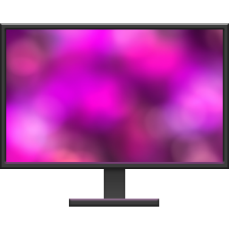

# Ambient Monitor
An app to make extra monitors ambient displays for games and video by blurring mirrored duplicates of the primary display.  
  
Image stretches to window size. For multi-monitor setups, run multiple instances.

#
# [There is now a browser-based, no-download version here (has GUI, causes less issues, but lower framerate).](https://casketpizza.github.io/AmbientMonitor/)

## Setup (for Python based downloadable version)
Download and install Python3, then run the RUN ME FIRST to install all the requirements automatically.
Once they're done, just run the exe.

## Controls:
**Spacebar**: Toggle full-screen  
**Enter**: Toggle between the entire primary monitor, the left half, or the right half.  
**1**: Decrease brightness.  
**2**: Increase brightness.  
**3**: Decrease gamma.  
**4**: Increase gamma.  
**5**: Decrease internal image resolution.  
**6**: Increase internal image resolution (will affect performance).  
**7**: Decrease Gaussian blur.  
**8**: Increase Gaussian blur.  
**9**: Save settings.  
**0**: Reset all settings (does not affect save until overwritten).  
##
Written in Python 3 with the help of ChatGPT.  
*I have no coding expertise, please feel free to modify this script. I tried to get it to fade to black on the outside edges and to display the controls within the window but had no success. It's also dreadfully unoptimised, and could potentially affect game performance.*
